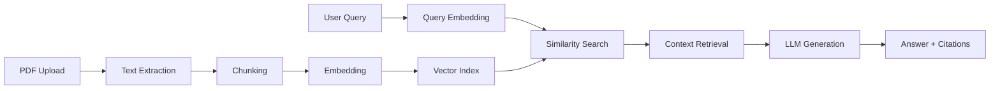

# 📚 SmartReader

> Your personal AI-powered book assistant that runs completely offline

SmartReader is a Windows desktop application that transforms how you interact with PDF documents. Upload any book or paper, ask questions in plain English, and get instant answers with exact page citations—all powered by AI that runs locally on your machine.


[](https://github.com/hamii31/SmartReader/releases)
[](LICENSE)
[](https://github.com/hamii31/SmartReader/releases)

---

## ✨ Features

### 🔐 Privacy First
- **100% Local** - All processing happens on your machine
- **No Cloud Dependencies** - Your documents never leave your computer
- **Completely Offline** - Works without internet after initial setup

### 💬 Natural Interaction
- **Plain English Queries** - Ask questions like you're talking to a person
- **Context-Aware Answers** - Get relevant responses based on your document
- **Page Citations** - Every answer includes exact page references

### 🚀 Performance
- **Smart Caching** - Books are indexed once, then load instantly
- **Large Document Support** - Handle 900+ page books effortlessly
- **Fast Responses** - Get answers in 5-10 seconds

### 🎯 User Experience
- **Setup Wizard** - Guided installation for first-time users
- **Clean Interface** - Intuitive design focused on productivity
- **No Configuration** - Works out of the box

---

## 📥 Download

### Latest Release (v1.1.0)

**[⬇️ Download SmartReader.exe](https://github.com/hamii31/SmartReader/releases/download/v1.1.0/SmartReader.exe)**

*Size: ~25 MB | Platform: Windows 10/11 | License: MIT*

## 📋 System Requirements

| Component | Minimum | Recommended |
|-----------|---------|-------------|
| **OS** | Windows 10 (64-bit) | Windows 11 |
| **RAM** | 8 GB | 16 GB |
| **Storage** | 10 GB free | 20 GB free |
| **CPU** | Intel i5 / AMD Ryzen 5 | Intel i7 / AMD Ryzen 7 |
| **Internet** | Required for setup only | - |

---

## 🚀 Quick Start

### Installation

1. **Download** `SmartReader.exe` from the link above
2. **Run** the executable (double-click)
3. **Handle Windows Security Warning** (if shown):
   - Click "More info"
   - Click "Run anyway"
   
   *Note: This warning appears because the app isn't digitally signed. It's safe to run.*

4. **Follow Setup Wizard** (10-15 minutes):
   - Install Ollama (AI engine)
   - Download language models (~2-3 GB)
   - Configure settings

### First Use

1. **Launch SmartReader** (after setup)
2. **Click** "Load PDF Book"
3. **Select** your PDF file
4. **Wait** for indexing (first time only: 10-15 mins for large books)
5. **Ask questions** in the query box
6. **Get answers** with page citations!

### Example Queries
```
"What is the main argument of chapter 3?"
"Summarize the methodology section"
"What does the author say about climate change?"
"List all the conclusions mentioned in the book"
"What are the key findings on page 45-50?"
```

## 🛠️ Technology Stack

### Core Technologies
- **Python 3.14** - Application framework
- **Tkinter** - Cross-platform GUI
- **Ollama** - Local LLM inference engine

### AI/ML Components
- **llama3.2** - Language model (2B parameters)
- **nomic-embed-text** - Text embedding model
- **RAG Architecture** - Retrieval-Augmented Generation

### Libraries
- **PyPDF2** - PDF parsing and text extraction
- **NumPy** - Vector operations and similarity search
- **Requests** -  HTTP client (setup only, checks Ollama server status)
- **PyInstaller** - Executable packaging

---

## 🏗️ Architecture

SmartReader implements a **Retrieval-Augmented Generation (RAG)** pipeline:


### Pipeline Steps

1. **PDF Ingestion** 
   - Extract text while preserving page numbers
   - Handle complex layouts and multi-column formats

2. **Intelligent Chunking**
   - Split into overlapping segments (1000 chars, 200 overlap)
   - Maintain context across chunk boundaries

3. **Semantic Embedding**
   - Convert text to 768-dimensional vectors
   - Use nomic-embed-text for high-quality embeddings

4. **Vector Indexing**
   - Create searchable database with NumPy
   - Cache indexes for instant subsequent loads

5. **Query Processing**
   - Embed user query in same vector space
   - Find top-K relevant chunks via cosine similarity

6. **Answer Generation**
   - Feed context to llama3.2
   - Generate coherent answers with citations
   - Return page references for verification

---

## 🔧 Building from Source

### Prerequisites
```bash
# Python 3.10 or higher
python --version

# Ollama installed
ollama --version

# Git (optional, for cloning)
git --version
```

### Installation Steps
```bash
# Clone repository
git clone https://github.com/hamii31/SmartReader.git
cd SmartReader

# Create virtual environment
python -m venv venv
venv\Scripts\activate  # Windows
# source venv/bin/activate  # macOS/Linux

# Install dependencies
pip install -r requirements.txt

# Download required models
ollama pull llama3.2
ollama pull nomic-embed-text

# Run application
python main_launcher.py
```

### Building Executable
```bash
# Build with PyInstaller
python build_executable.py

# Output location
cd dist
SmartReader.exe
```

---

## 📦 Project Structure
```
SmartReader/
│
├── main_launcher.py          # Entry point and setup checker
├── setup_wizard.py           # First-time setup wizard
├── book_rag_gui.py          # Main application GUI
├── ollama_book_rag.py       # RAG engine implementation
├── build_executable.py      # PyInstaller build script
├── requirements.txt         # Python dependencies
│
├── cache/                   # Book indexes (auto-generated)
├── dist/                    # Built executable
│
└── README.md               # This file
```

---

## 🐛 Troubleshooting

### Windows Security Warning

**Issue:** Windows shows "Unknown publisher" warning

**Solution:** This is normal for unsigned apps. Click "More info" → "Run anyway"

### Antivirus False Positive

**Issue:** Antivirus blocks SmartReader.exe

**Solution:** 
1. Whitelist SmartReader.exe in your antivirus
2. The app is safe—false positives are common with PyInstaller executables

### Ollama Connection Error

**Issue:** "Could not connect to Ollama"

**Solution:**
1. Ensure Ollama is installed
2. Run `ollama serve` in Command Prompt
3. Keep that window open while using SmartReader

### Slow First Query

**Issue:** First query takes 2-3 minutes

**Solution:** This is normal - Ollama is loading the model into memory. Subsequent queries are fast.

### Out of Memory

**Issue:** Application crashes with large PDFs

**Solution:**
- Ensure you have 16GB RAM
- Close other applications
- Try smaller PDF files (under 500 pages)

---

## 📝 Roadmap

### Version 1.2 (2025)
- [ ] Multiple book support (query across books)
- [ ] Export chat history
- [ ] Dark mode

---

## 🤝 Contributing

Contributions are welcome! Here's how you can help:

### Reporting Bugs
- Use the [issue tracker](https://github.com/hamii31/SmartReader/issues)
- Include steps to reproduce
- Attach error logs if available

### Suggesting Features
- Open an issue with the "enhancement" label
- Describe your use case
- Explain why it would be useful

### Pull Requests
1. Fork the repository
2. Create a feature branch (`git checkout -b feature/amazing-feature`)
3. Commit your changes (`git commit -m 'Add amazing feature'`)
4. Push to the branch (`git push origin feature/amazing-feature`)
5. Open a Pull Request

### Development Setup
```bash
# Install dev dependencies
pip install -r requirements-dev.txt

# Run tests
python -m pytest tests/

# Format code
black .
```

---

## 📄 License

This project is licensed under the MIT License - see the [LICENSE](LICENSE) file for details.
```
MIT License

Copyright (c) 2025 YOUR_NAME

Permission is hereby granted, free of charge, to any person obtaining a copy
of this software and associated documentation files (the "Software"), to deal
in the Software without restriction, including without limitation the rights
to use, copy, modify, merge, publish, distribute, sublicense, and/or sell
copies of the Software, and to permit persons to whom the Software is
furnished to do so, subject to the following conditions:

The above copyright notice and this permission notice shall be included in all
copies or substantial portions of the Software.

THE SOFTWARE IS PROVIDED "AS IS", WITHOUT WARRANTY OF ANY KIND, EXPRESS OR
IMPLIED, INCLUDING BUT NOT LIMITED TO THE WARRANTIES OF MERCHANTABILITY,
FITNESS FOR A PARTICULAR PURPOSE AND NONINFRINGEMENT.
```

---

## 🙏 Acknowledgments

- **Ollama Team** - For making local LLM inference accessible
- **Meta AI** - For the Llama model family
- **Nomic AI** - For the excellent embedding model
- **Python Community** - For the amazing ecosystem
- **Open Source Contributors** - For inspiration and tools

---

## 👨‍💻 Author Info

**Hami**

- 🌐 [Other Deployed Projects](https://share.streamlit.io/user/hamii31)
- 💼 [LinkedIn](https://www.linkedin.com/in/hami-ibriyamov/)
- 🐙 [GitHub](https://github.com/hamii31)
- 📧 Email: ibriyamovhami@gmail.com

---

## 📊 Stats


---

## 💖 Support

If you find SmartReader useful, consider:

- ⭐ **Starring** the repository
- 🐛 **Reporting bugs** you encounter
- 💡 **Suggesting features** you'd like
- 📢 **Sharing** with others who might benefit
- ☕ **[Buy me a coffee](https://buymeacoffee.com/ibriyamovhq)** 

---

<p align="center">
  <strong>Built with ❤️ using Python and AI</strong><br>
  <sub>Made as a portfolio project demonstrating RAG implementation</sub>
</p>

<p align="center">
  <a href="#-download">Download</a> •
  <a href="#-quick-start">Quick Start</a> •
  <a href="#-troubleshooting">Troubleshooting</a> •
  <a href="#-contributing">Contributing</a>
</p>
